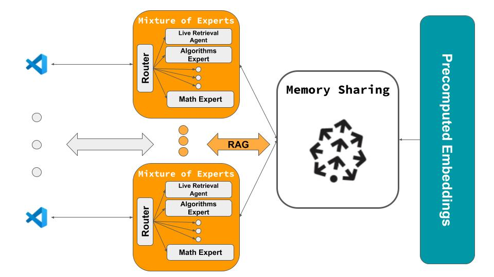
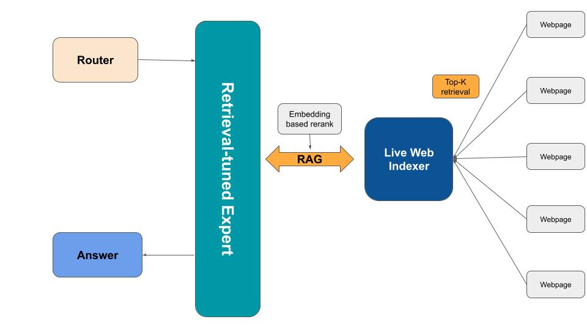

# HiveMind: AI-Powered Code Editor with Shared Memory

HiveMind is an innovative AI-powered code editor designed for large organizations, built upon the foundation of Cursor. It addresses the common challenge of multiple team members encountering and solving the same issues independently, especially when working with complex codebases and dependencies. By implementing a shared central context across all users, HiveMind enables efficient knowledge sharing and problem-solving within teams.

## Demo:
For demo, architecture of the project and updates, visit our [Devpost page](https://devpost.com/software/hivemind-usmy41). We will be releasing our extension on VSCode soon!

## Architecture:

*Architecure for HiveMind. More details below.*


*Mixture of Experts Framework in HiveMind with OpenAI swarm.*

## Features
- **Shared Memory**: Solutions to common issues are stored and accessible to all team members, reducing redundant problem-solving.
- **Mixture of Experts**: Utilizes an OpenAI swarm model with specialized experts (e.g., Systems, ML, Frontend) to provide tailored solutions.
- **Real-time Collaboration**: Seamless integration with Continue (open-source alternative to Cursor) for a collaborative coding experience.
- **Advanced Context Retrieval**: Implements Retrieval-Augmented Generation (RAG) using Pinecone for enhanced context-aware responses.

## Architecture
HiveMind consists of two main components:
- Frontend: Built on Continue, providing the user interface for code editing and AI interactions.
- Backend: Python-based server using FastAPI, interfacing with Pinecone for vector storage and OpenAI for AI model interactions.

## Installation
To set up HiveMind, follow these steps:
1) Clone the repository:
```bash
git clone https://github.com/Sam-Fatehmanesh/Cerebral_hive_backend.git
cd Cerebral_hive_backend
```

2) Install Dependencies:
```bash
pip install -r requirements.txt
```

3) Set up environment variables:
Create a .env file in the root directory and add the following:
text

```bash
OPENAI_API_KEY=your_openai_api_key
PINECONE_API_KEY=your_pinecone_api_key
PINECONE_ENVIRONMENT=your_pinecone_environment
```

## Usage:
To run the HiveMind backend:

```bash
uvicorn main:app --reload
```
uvicorn main:app --reload

This will start the FastAPI server, which handles requests from the Continue frontend and manages interactions with OpenAI and Pinecone.

## File Structure and Descriptions

### `main.py`
- Main FastAPI application integrating all components.
- Key features:
  - Pinecone vector database integration for context storage and retrieval
  - OpenAI API integration for generating embeddings
  - `/chat/completions` endpoint for processing queries and streaming responses
  - Answer storage functionality

### `inference.py`
- Defines the core logic for the Mixture of Experts system.
- Key components:
  - Various expert agents (Python, Data Structures, Algorithms, Web Development, Database, Machine Learning)
  - Web Scraper Agent for gathering online information
  - Router Agent for directing queries to appropriate experts
  - `get_response` function to process user queries

### `frontapi.py`
- Implements a FastAPI server for handling chat completions and text completions.
- Key features:
  - `/v1/chat/completions` endpoint for chat model interactions
  - `/v1/completions` endpoint for text completion model interactions
  - Mock response generation for demonstration purposes

### `preprocess_codeqa.py`
- Preprocesses the CodeQA dataset for use in the system.
- Functions:
  - `download_file`: Downloads the dataset from GitHub
  - `process_codeqa_dataset`: Processes the raw data into a usable format

### `test_endpoint.py`
- Contains tests for the API endpoints.
- Tests:
  - Chat completion functionality
  - Answer storage functionality
  - Prints vector database contents for verification

### `unit_test.py`
- Comprehensive unit tests for the Context API.
- Tests various aspects including:
  - Context retrieval
  - Context length
  - Repeated queries
  - Special character handling
  - Concurrent request handling

### `websearch.py`
- Implements web scraping functionality.
- Key functions:
  - `get_html_content`: Extracts and cleans content from web pages
  - `scrape_web`: Performs Google searches and retrieves content from top results

## Technical Implementation Highlights

- FastAPI for backend API development
- Pinecone for vector database storage and retrieval
- OpenAI API for generating embeddings and language model interactions
- Mixture of Experts architecture using specialized agent models
- Web scraping capabilities for real-time information retrieval
- Streaming responses for efficient communication with the frontend
- Integration with Continue (open-source Cursor alternative) for the user interface